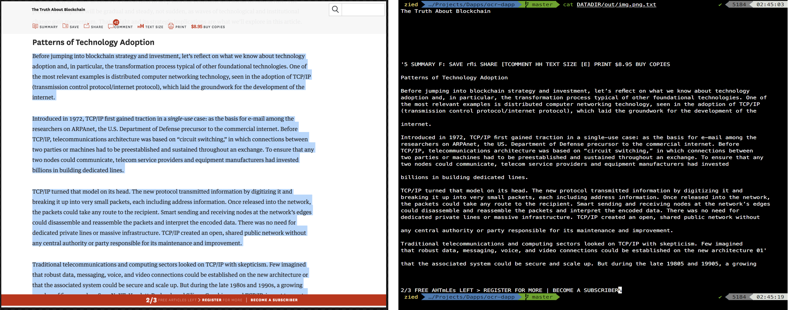
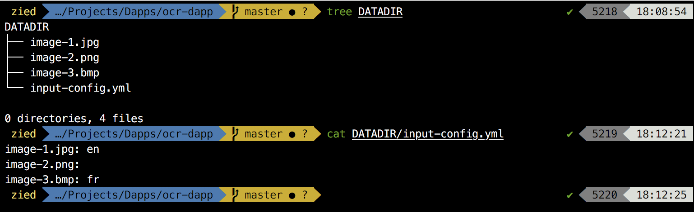
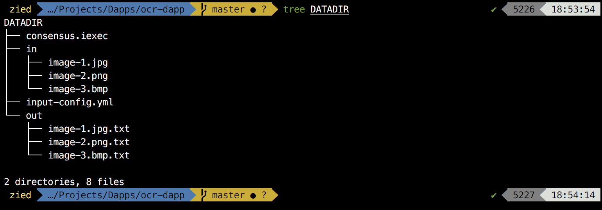

## Description

image2text is an Ethereum ready dapp that applies google's [tesseract-OCR](https://github.com/tesseract-ocr/tesseract) engine to extract text from images. So whether you are creating a billing app or converting images to searchable pdfs, image2text is the right tool.  




## Usage

Bring your images together in a folder (exp: DATADIR) and add an ```input-config.yml``` file in the same folder. This file defines text's language for each image and it should respect the ```<imagename>: <lang>``` format. You can keep the language's section empty but this may affect the performance of the extraction process.



In the ```app/app-config.yml``` file, change the datadir parameter to the path of your folder (DATADIR for our example) and run the script.

    $ git clone https://github.com/Zied-Guesmi/image2text.git && cd image2text/
    $ sed -i "s/\/iexec/<path/to/datadir/folder>/" app/app-config.yml
    $ python3 app/src/app.py

You shoud find your extracted text files in the ```DATADIR/out/``` folder.




## Supported languages

Arabic (**ar**), Chinese simple (**zh**), English (**en**), Spanish (**es**), Frensh (**fr**),  German (**de**),  Italian (**it**), Japanese (**ja**),Korean (**ko**), Portuguese (**pt**), Russian (**ru**), Turkish (**tr**).


## Supported image types

Tested extensions: **jpeg**, **bmp**, **png**  
Those extensions are accepted but were not tested yet: **pbm**, **pgm**, **ppm**, **tiff**, **rast**, **xbm**  


## Dependencies

- [python3](https://www.python.org/)  
- [tesseract-ocr](https://github.com/tesseract-ocr/tesseract)  
- [opencv](https://opencv.org/)


## Docker deployment

After installing [docker](https://docs.docker.com/install/) and preparing your DATADIR folder, just grab the docker image from dockerhub and run it:

    $ docker run -v abs/path/to/datadir:/iexec/ ziedguesmi/image2text

Or you can build your own image from dockerfile:

    # clone the dapp
    $ git clone https://github.com/Zied-Guesmi/image2text.git && cd image2text/ 

    # build the docker image
    $ docker build -t image2text .

    # run the container
    $ docker run -v abs/path/to/datadir:/iexec/ image2text


## Installation

Install system dependencies:

    # ubuntu as an example
    $ apt-get update && apt-get install -y \
        libtesseract-dev \
        libsm6 \
        python3 \
        python3-pip \
        tesseract-ocr \
        tesseract-ocr-ara \
        tesseract-ocr-eng \
        tesseract-ocr-fra \
        tesseract-ocr-spa \
        tesseract-ocr-deu \
        tesseract-ocr-chi-sim \
        tesseract-ocr-ita \
        tesseract-ocr-jpn \
        tesseract-ocr-por \
        tesseract-ocr-rus \
        tesseract-ocr-tur \
        tesseract-ocr-kor

Clone the app:

    $ git clone https://github.com/Zied-Guesmi/image2text.git

Install python depedencies:

    $ cd image2text/
    $ pip3 install -r app/requirements.txt


## Authors

- **[Zied Guesmi](https://github.com/Zied-Guesmi)**


## License

This project is licensed under the MIT License - see the [LICENSE](https://github.com/Zied-Guesmi/text2speech/blob/master/LICENSE) file for details