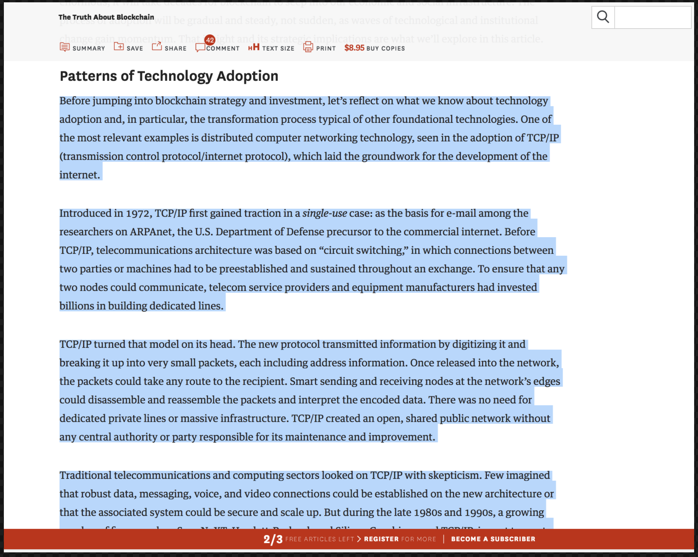
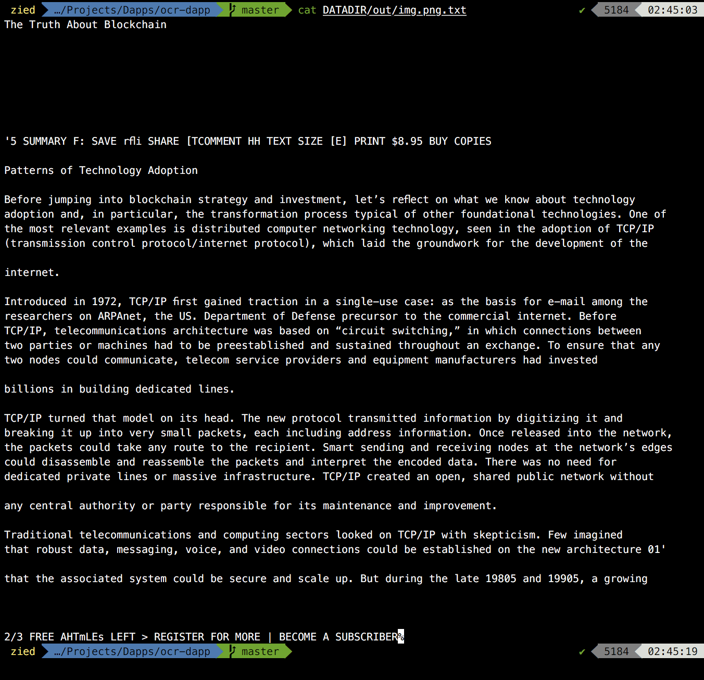

# OCR-Dapp


## Description
This dapp applies [tesseract-OCR](https://github.com/tesseract-ocr/tesseract) on images and extracts text from them.
 


## Usage
* Put your images in a directory (we'll call it DATADIR) and add your ```input.config``` file to define language for each image. Your ```input.config```
file should respect the ```<imagename>:<lang>``` format.


* Change datadir name in app-config.yml to the name of your folder (DATADIR for our example)  

* Run the script

    # python3 app.py

* You shoud find your text files in the ```DATADIR/out/``` folder


## Supported languages
English (**en**), Spanish (**es**), Frensh (**fr**), Arabic (**ar**), German (**de**), Chinese simple (**zh**), Italian (**it**), Japanese (**ja**), Portuguese (**pt**), Russian (**ru**), Turkish (**tr**), Korean (**ko**).


## Supported image types
Tested extensions: **jpeg**, **bmp**, **png**  
Those extensions were not tested so they may not work properly: **pbm**, **pgm**, **ppm**, **tiff**, **rast**, **xbm**  

## Dependencies
[python3](https://www.python.org/)  
[tesseract-ocr](https://github.com/tesseract-ocr/tesseract)  
[opencv](https://opencv.org/)


## Docker installation

* Install [docker](https://docs.docker.com/install/)

* Prepare your datadir folder and grab the image from dockerhub

    $ docker run -v path/to/images/dir:/iexec/ ziedguesmi/ocr python app.py

    $ ______ in/
        |___ out/
        |___ input.config

* Or you can build the image from dockerfile

    # clone the dapp
    $ git clone https://github.com/Zied-Guesmi/ocr-dapp.git

    # build docker image
    $ cd ocr-dapp/ && docker build -t ocr-dapp .

    # run the docker container
    $ docker run -v path/to/images/dir:/iexec/ ocr-dapp python3 app.py


## Installation
Install system dependencies:

    $ apt-get update && apt-get install -y \
        python3 \
        python3-pip \
        libtesseract-dev \
        tesseract-ocr \
        tesseract-ocr-ara \
        tesseract-ocr-eng \
        tesseract-ocr-fra \
        tesseract-ocr-spa \
        tesseract-ocr-deu \
        tesseract-ocr-chi-sim \
        tesseract-ocr-ita \
        tesseract-ocr-jpn \
        tesseract-ocr-por \
        tesseract-ocr-rus \
        tesseract-ocr-tur \
        tesseract-ocr-kor
        
Install python depedencies:

    $ git clone https://github.com/Zied-Guesmi/ocr-dapp.git
    $ cd ocr-dapp/app/
    $ pip3 install -r requirements.txt